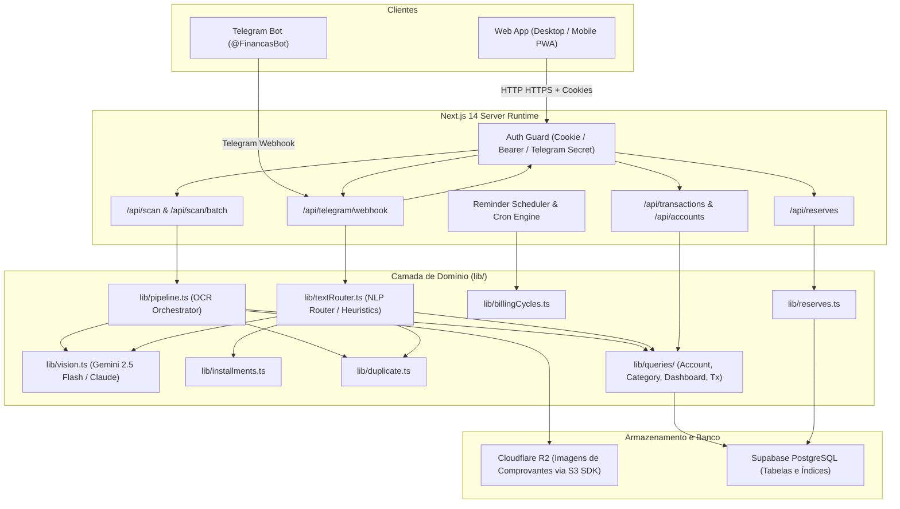

# Arquitetura do Sistema

Este documento descreve a topologia de arquitetura, camadas da aplicação, fluxo de dados, pipeline de inteligência artificial, autenticação e integração com Telegram Bot.

---

## 1. Visão Geral da Topologia

A aplicação é construída sobre **Next.js 14 (App Router)** com **TypeScript** e opera como uma aplicação full-stack monolítica moderna hospedada preferencialmente em ambiente serverless (Vercel ou Docker/Node).



---

## 2. Estrutura de Diretórios e Módulos

```
receipt-scanner/
├── app/                        # Next.js 14 App Router
│   ├── api/                    # Rotas de API HTTP (REST)
│   │   ├── accounts/           # CRUD de contas bancárias e cartões
│   │   ├── auth/               # Login, logout e status de sessão web
│   │   ├── categories/         # Listagem e gestão de categorias
│   │   ├── dashboard/          # Agregações de métricas e compromissos
│   │   ├── export/             # Exportações em CSV
│   │   ├── reserves/           # Gestão de metas de reservas e movimentações
│   │   ├── scan/               # OCR e ingestão de comprovantes (single & batch)
│   │   ├── telegram/           # Webhook receptor de mensagens do Bot
│   │   └── transactions/       # Lançamentos e parcelamentos
│   ├── layout.tsx              # Shell raiz com viewport e temas
│   └── page.tsx                # SPA unificada com tabs e drawers
│
├── components/                 # Componentes React (Tailwind CSS)
│   ├── accounts/               # Gestão de cartões, faturas e reservas
│   ├── dashboard/              # Gráficos, métricas e compromissos
│   ├── launch/                 # Telas de revisão de notas e novos lançamentos
│   ├── modals/                 # Modais de edição de transação e formulários
│   └── transactions/           # Tabela de lançamentos, filtros e paginação
│
├── lib/                        # Camada de Domínio, Queries e Serviços
│   ├── queries/                # Módulos especializados de consulta Supabase
│   │   ├── accountQueries.ts
│   │   ├── categoryQueries.ts
│   │   ├── dashboardQueries.ts
│   │   └── transactionQueries.ts
│   ├── accountsMetadata.ts     # Fachada de compatibilidade de contas
│   ├── authGuard.ts            # Guardião de autenticação de APIs
│   ├── billingCycles.ts        # Cálculo de cortes e faturas de cartão
│   ├── canonicalVendor.ts      # Normalização de nomes de lojas
│   ├── creditCardSkins.ts      # Temas e cores de cartões
│   ├── duplicate.ts            # Detecção de transações duplicadas
│   ├── formatters.ts           # Formatadores monetários (BRL) e datas
│   ├── installments.ts         # Motor matemático de parcelamentos
│   ├── persist.ts              # Cliente Supabase e persistência transacional
│   ├── pipeline.ts             # Orquestrador de imagem -> IA -> banco
│   ├── recurrence.ts           # Projeção de despesas recorrentes
│   ├── reminders.ts            # Motor de alertas e deduplicação de bot
│   ├── reserves.ts             # Serviço de reservas financeiras
│   ├── schema.ts               # Contratos Zod e Tipos TypeScript
│   ├── textRouter.ts           # Processamento e roteamento de texto do Telegram
│   └── vision.ts               # Integração com APIs de Visão Computacional
│
├── supabase/
│   └── migrations/             # Migrações SQL versionadas
└── test/                       # Testes E2E e testes de integração
```

---

## 3. Principais Fluxos do Sistema

### 3.1. Ingestão de Comprovante via Imagem (Web ou Telegram)
1. **Upload / Recebimento:** A imagem é enviada via formulário Web ou enviada como foto no Telegram.
2. **Armazenamento e Hash:** `lib/storage.ts` gera o hash SHA-256 e envia a imagem bruta para o bucket Cloudflare R2 (se configurado).
3. **Pré-processamento:** `sharp` redimensiona a imagem para a resolução ideal de OCR (`MAX_IMAGE_PX`), corrigindo rotação EXIF.
4. **Visão Computacional e IA:** `lib/vision.ts` invoca a API do Gemini ou Claude com o schema estruturado de `Receipt`.
5. **Validação Zod:** `lib/schema.ts` valida tipagem estrita de cada campo retornado.
6. **Preflight de Duplicidade:** `lib/duplicate.ts` verifica se a transação já foi lançada recentemente.
7. **Persistência Atômica:** `lib/persist.ts` grava o cabeçalho em `transactions`, itens em `transaction_items` e resolve o estabelecimento canônico em `canonical_vendors`.

### 3.2. Lançamento por Texto Livre no Telegram
1. Usuário envia: *"Almoço 45,00 no débito Inter"*.
2. `lib/textRouter.ts` tenta parser heurístico de alta velocidade sem custo de IA.
3. Se o texto for ambíguo, aciona chamada rápida de IA para extrair parâmetros financeiros estruturados.
4. Gera botão inline no Telegram para o usuário confirmar o lançamento em 1 clique.

---

## 4. Segurança e Autenticação

1. **Sessão Web:**
   - Controlada por cookie seguro HTTP-Only (`fin_session`) gerado após autenticação via senha em `/api/auth/login`.
   - Validada em cada requisição de API por `requireFinancialAuth` em [`lib/authGuard.ts`](file:///Users/arnaldofernandes/Desktop/receipt-scanner/lib/authGuard.ts).
2. **Telegram Bot:**
   - Webhook validado via header `x-telegram-bot-api-secret-token`.
   - Lançamentos e comandos restritos exclusivamente ao ID de usuário configurado em `TELEGRAM_ALLOWED_USER_ID`.
3. **Banco de Dados (Supabase):**
   - Políticas de Row Level Security (RLS) configuradas e chaves de serviço (`SERVICE_ROLE_KEY`) restritas exclusivamente às rotas de backend (não expostas no cliente).

---

## 5. Fonte de Verdade dos Módulos

| Funcionalidade | Módulo Central |
| :--- | :--- |
| **Contratos e Tipos** | [`lib/schema.ts`](file:///Users/arnaldofernandes/Desktop/receipt-scanner/lib/schema.ts) |
| **Consultas SQL** | [`lib/queries/`](file:///Users/arnaldofernandes/Desktop/receipt-scanner/lib/queries/) |
| **Parcelamento** | [`lib/installments.ts`](file:///Users/arnaldofernandes/Desktop/receipt-scanner/lib/installments.ts) |
| **Ciclos de Fatura** | [`lib/billingCycles.ts`](file:///Users/arnaldofernandes/Desktop/receipt-scanner/lib/billingCycles.ts) |
| **Reservas** | [`lib/reserves.ts`](file:///Users/arnaldofernandes/Desktop/receipt-scanner/lib/reserves.ts) |
| **Alertas do Bot** | [`lib/reminders.ts`](file:///Users/arnaldofernandes/Desktop/receipt-scanner/lib/reminders.ts) |
| **Visão / OCR** | [`lib/vision.ts`](file:///Users/arnaldofernandes/Desktop/receipt-scanner/lib/vision.ts) |
