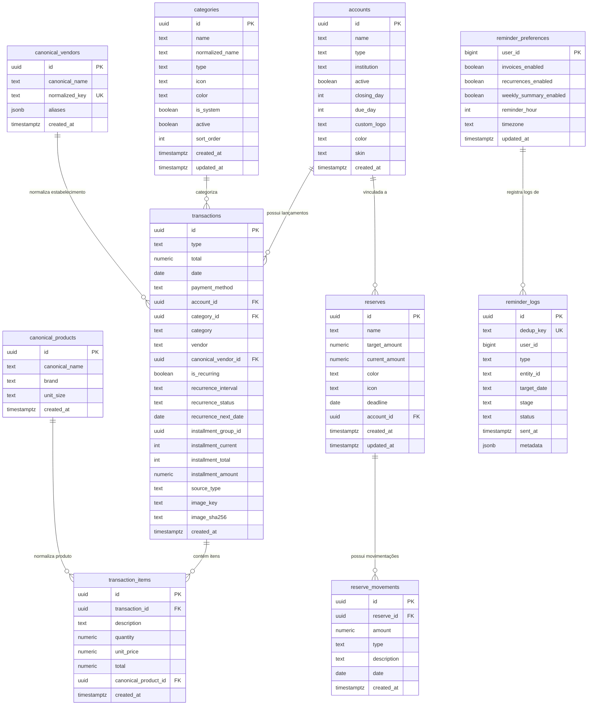

# Modelo de Dados (Supabase / PostgreSQL)

Este documento descreve o esquema de banco de dados relacional hospedado no Supabase, detalhando tabelas, colunas, tipos, chaves estrangeiras, restrições e índices.

---

## 1. Diagrama Entidade-Relacionamento (ERD)

---

## 2. Detalhamento das Tabelas

### 2.1. `accounts` (Contas Bancárias e Cartões)
- **`id`** (`uuid`, PK): Identificador único da conta.
- **`name`** (`text`, NOT NULL): Nome amigável (ex.: *"Cartão Inter"*, *"Carteira"*).
- **`type`** (`text`, NOT NULL): Tipo da conta (`bank_account`, `cash`, `credit_card`, `debit_card`, `digital_wallet`, `other`).
- **`institution`** (`text`, NULLABLE): Nome da instituição bancária.
- **`active`** (`boolean`, DEFAULT `true`): Status ativo/inativo.
- **`closing_day`** (`int`, CHECK 1-31): Dia de fechamento da fatura (cartões).
- **`due_day`** (`int`, CHECK 1-31): Dia de vencimento da fatura (cartões).
- **`custom_logo`** (`text`, NULLABLE): URL ou identificador do logo do banco.
- **`color`** (`text`, NULLABLE): Cor primária visual hex.
- **`skin`** (`text`, NULLABLE): ID do tema visual do cartão.
- **`created_at`** (`timestamptz`, DEFAULT `now()`).

---

### 2.2. `transactions` (Lançamentos Financeiros)
- **`id`** (`uuid`, PK): Identificador único do lançamento.
- **`type`** (`text`, CHECK `type IN ('expense', 'income')`): Tipo do lançamento.
- **`total`** (`numeric(12, 2)`, NOT NULL): Valor total da transação ou valor base.
- **`date`** (`date`, NOT NULL): Data da compra/lançamento.
- **`payment_method`** (`text`, NULLABLE): Forma de pagamento (`Pix`, `Cartão de Crédito`, etc.).
- **`account_id`** (`uuid`, FK $\rightarrow$ `accounts.id` ON DELETE SET NULL).
- **`category_id`** (`uuid`, FK $\rightarrow$ `categories.id` ON DELETE SET NULL).
- **`category`** (`text`, NULLABLE): Nome textual da categoria para fallback.
- **`vendor`** (`text`, NULLABLE): Nome original do estabelecimento.
- **`canonical_vendor_id`** (`uuid`, FK $\rightarrow$ `canonical_vendors.id` ON DELETE SET NULL).
- **`is_recurring`** (`boolean`, DEFAULT `false`): Flag de recorrência/assinatura.
- **`recurrence_interval`** (`text`, NULLABLE): Intervalo (`monthly`, `weekly`, etc.).
- **`recurrence_status`** (`text`, DEFAULT `'active'`): Status (`active`, `paused`).
- **`recurrence_next_date`** (`date`, NULLABLE): Próximo vencimento previsto.
- **`installment_group_id`** (`uuid`, NULLABLE): Identificador do grupo de parcelas.
- **`installment_current`** (`int`, NULLABLE): Número da parcela atual ($1..N$).
- **`installment_total`** (`int`, NULLABLE): Quantidade total de parcelas ($N$).
- **`installment_amount`** (`numeric(12, 2)`, NULLABLE): Valor individual desta parcela.
- **`source_type`** (`text`, CHECK `source_type IN ('image', 'text')`): Canal de origem.
- **`image_key`** (`text`, NULLABLE): Chave do comprovante no Cloudflare R2.
- **`image_sha256`** (`text`, NULLABLE): Hash criptográfico da imagem.
- **`created_at`** (`timestamptz`, DEFAULT `now()`).

---

### 2.3. `reserves` e `reserve_movements` (Metas e Guardados)
- **`reserves`**:
  - `id` (`uuid`, PK);
  - `name` (`text`, NOT NULL);
  - `target_amount` (`numeric(12, 2)`, NULLABLE);
  - `current_amount` (`numeric(12, 2)`, DEFAULT 0);
  - `color`, `icon`, `deadline` (`date`, NULLABLE);
  - `account_id` (`uuid`, FK $\rightarrow$ `accounts.id` ON DELETE SET NULL);
  - `created_at`, `updated_at` (`timestamptz`).
- **`reserve_movements`**:
  - `id` (`uuid`, PK);
  - `reserve_id` (`uuid`, FK $\rightarrow$ `reserves.id` ON DELETE CASCADE);
  - `amount` (`numeric(12, 2)`, NOT NULL);
  - `type` (`text`, CHECK `type IN ('deposit', 'withdraw')`);
  - `description` (`text`, NULLABLE);
  - `date` (`date`, NOT NULL);
  - `created_at` (`timestamptz`).

---

### 2.4. `reminder_preferences` e `reminder_logs` (Bot do Telegram)
- **`reminder_preferences`**:
  - `user_id` (`bigint`, PK);
  - `invoices_enabled` (`boolean`, DEFAULT `false`);
  - `recurrences_enabled` (`boolean`, DEFAULT `false`);
  - `weekly_summary_enabled` (`boolean`, DEFAULT `false`);
  - `reminder_hour` (`int`, DEFAULT `9`);
  - `timezone` (`text`, DEFAULT `'America/Sao_Paulo'`);
  - `updated_at` (`timestamptz`).
- **`reminder_logs`**:
  - `id` (`uuid`, PK);
  - `dedup_key` (`text`, UNIQUE NOT NULL);
  - `user_id` (`bigint`, NOT NULL);
  - `type` (`text`, NOT NULL);
  - `stage` (`text`, NOT NULL);
  - `status` (`text`, NOT NULL);
  - `sent_at` (`timestamptz`);
  - `metadata` (`jsonb`).
